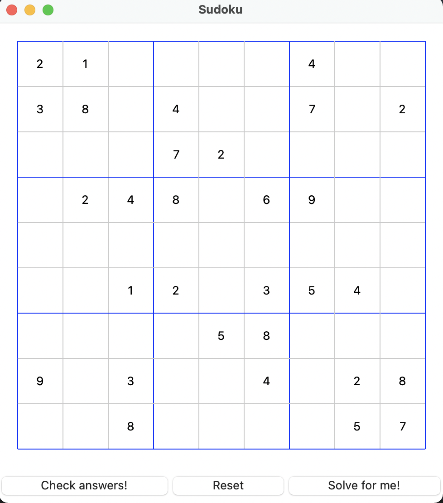
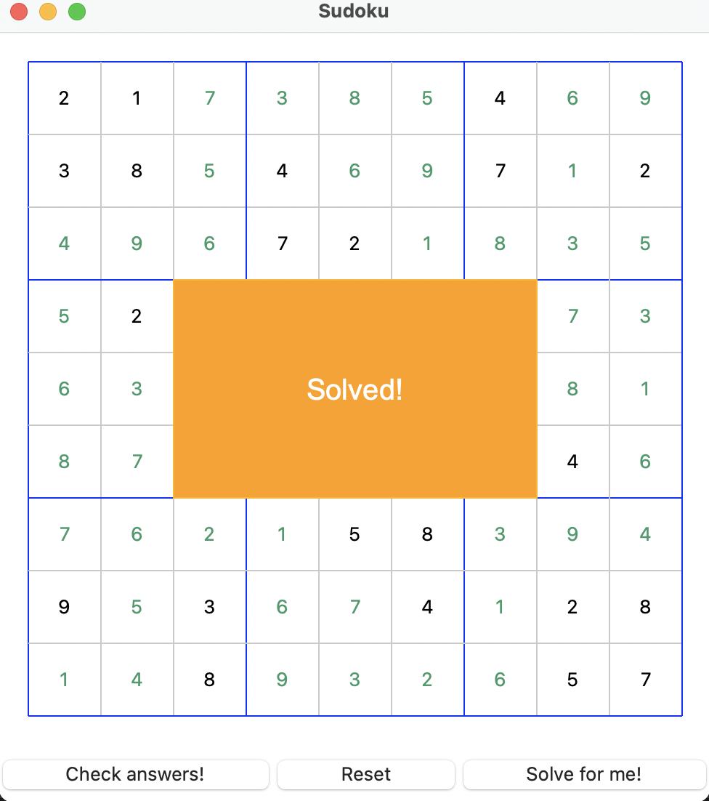

# Sudoku

Sudoku game

### Prerequisite
* This application only works with `python3`.
* This application only runs on an OS with GUI support. 

### Rules
Sudoku is played on a grid of 9 x 9 spaces. Within the rows and columns are 9 “squares” (made up of 3 x 3 spaces). 

Each row, column and square (9 spaces each) needs to be filled out with the numbers 1-9, without repeating any numbers within the row, column or square.

### How to run
* open terminal and navigate to the `sudoku` directory
* run `python3 sudoku.py`

### How to play
* Put numbers ranging from 1-9 in the empty boxes. Once done, click the "Check answers!" button to verify. 
**Note, partial solutions (incomplete board) will be considered unsolved.**

* Click "Reset" button to clear the board.
* Click "Solve for me!" to get the board solved automatically.
* When stuck, check `resources/solved.txt` for hints.
* Close the application once done playing.

### Screenshot

* When the game starts:

* Game solved:
